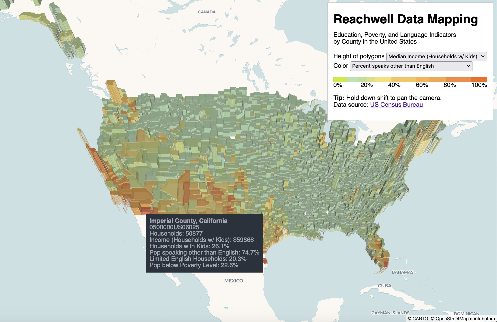
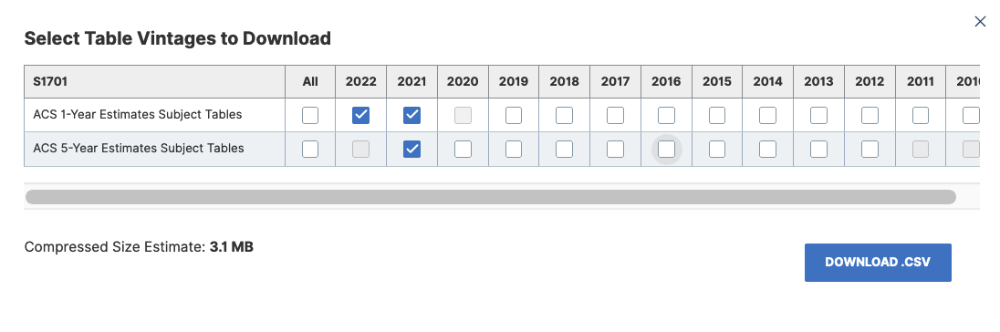

# Reachwell Data Mapping
Hello!

This repository contains code, visualizations, and modeling results for a project completed for [Reachwell](https://www.reachwellapp.com/), a non-profit company which connects families to schools and public entities through a multilingual chat and annoucements application.

The project objective was to identify US counties and school districts with a high need for Reachwell based on poverty, population, and multi-lingual indicators, and visualize these communities on a map. Reachwell client data (both raw data and the predicted likely buyers file) has been omitted from this repo, but a modified visualization (with client data omitted) can be viewed [here](https://cultonkoster.com/reachwell-site) and in the screenshot below:

To run or make changes to the code, first go to the [data](./data) folder and unzip all the `.zip` files. Then you can run the notebooks in the following order:

- [prepare](notebooks/prepare.ipynb): retrieve and rename data from saved census files. outputs `cty-sd-latest-indicators.csv`
- [make_plotly_vis](notebooks/make_plotly_vis.ipynb): create simple plots with county and school distrct data. outputs `geojson-school-districts.json`
- [extract_reachwell_client_list](notebooks/make_plotly_vis.ipynb): extract counnty and school district codes from the Reahwell client list (you will need the `.kml` annd `geojson-school-districts.json` file to run this). outputs `reachwell-clients.csv` 
- [model](notebooks/model.ipynb): outputs `school-districts-counties-predictions.xlsx` and `county-plots.json`
- [index](outputs/index.html): contains Javascript code that will render the entire page as an interactive map

More detail on all these steps below.

### Getting the Data 💾 

I downloaded the data for this project from from the following census sources:
1. [US census data explorer](https://data.census.gov/)
2. [US geography files](https://www.census.gov/geographies/mapping-files/time-series/geo/tiger-geodatabase-file.2022.html#list-tab-1258746043)

A note on the census indicators (1 above) from the ACS Census data [documentation](https://www.census.gov/data/developers/data-sets/ACS-supplemental-data.html):

>The American Community Survey (ACS) is an ongoing survey that provides data every year... The supplemental estimates consist of high-level detailed tables tabulated on the 1-year microdata for geographies with populations of 20,000 or more. The intention of this product is to allow people with smaller populations key estimates that are more current than the 5-Year file.

This means that updated 2022 data was not available for any school districts and counties with a population lower than `20,000` people. To address this issue, I combined data from multiple years: I started with the 5-Year file from 2021 and added more current indicators (from 2021 and 2022) when they were available for that geographic region. If you would like to download more indicators, select these file vintages from the census website when prompted:

All the census files that I used are avalable in compressed format inside the [data](./data) folder.

### Transforming the Data ⚙️

After downloading the census files, I exctracted a list of indicator variables. I collected these variables based on conversations with Jesse, and from [this](https://nces.ed.gov/Programs/Edge/ACSDashboard/0600014) NCES dashboard of educational indicators.  Here's a full list:

- population number (5 and older)
- total household number
- percent of limited english households
- percent of population speaking english only 
- percent of population speaking another language than English
- percent of population below poverty level
- percent of households with children
- percent of households recieving food stamps 
- percent of households with children that are a married family
- percent of kids in school that are enrolled in a private school 
- percent of kids in school that are enrolled in a public school
- median income of households with children (note: for a small number of high and low median incomes this variable will map to `250,000+` and `2,500-`. I set these values to be 250000 and 2500 respectively)

Code for extracting the data from census files (and updating lagged 5-year data with more recent ACS supplements) can be found in [this](notebooks/prepare.ipynb) notebook.

### Modeling 🎰

After extracting the data and the reachwell client list (see [here](notebooks/extract_client_list.ipynb)), I set up a classification problem to 
predict whether a county or school district might have a high need for Reachwell. Specifiicaly, counties and school districts that used either Reachwell
or a competitor were tagged with `label=1`, and all other counties and school districts were tagged with `label=0`. This created a highly imbalanced dataset (about 150:1). So for training, I balanced the dataset by only includinng 100 negative examples.

For model features, I used a non-overlapping subset of the indicators extracted from the [prepare](notebooks/prepare.ipynb) notebook (for example I omitted `pct_speaks_only_english` becaus it's perfectly colinear with `pct_speaks_other_than_english`). Of these features, `log_total_households` and `pct_speaks_other_than_english` were particularly important. This means that my model relied heavilly on these two indicators to predict likely Reachwell customers. Surprisingly, `pct_limited_english_households` was not an important indicator.

I also held on to 20% of the data to evaluate the model's performance. Below is a table the performance metrics. The first four are classification 
metrics that evaluate performance directly. The last two (`Average Precision` and `Precision@K`) are ranking/recommendation metrics, which evaluate the quality of the resulting ordered list.

| Model Name                       | Balanced Acc | Precision | Recall | F1 Score | Average Precision | Precision@500 |
|----------------------------------|--------------|-----------|--------|----------|-------------------|---------------|
| Baseline (always predicts 1)     | 0.500        | 0.006     | 1.000  | 0.013    | 0.007             | 0.006         |
| Logistic Regression with L2 loss | 0.760        | 0.029     | 0.667  | 0.056    | 0.037             | 0.030         |
| k-Nearest Neighors               | 0.676        | 0.015     | 0.611  | 0.030    | 0.019             | 0.016         |
| SVM with 2d Polynomial Kernel    | 0.767        | 0.032     | 0.667  | 0.061    | 0.091             | 0.028         |

The SVM (Support Vector Machine) performed the best (particularly on `Average Precision`), so I used it as my model for generating predictions and rankings for each 
school district and county. Pedictions can be found in the choropleth map (see visualizing the data), and are used to sort the rows of the outputted [excel file](outputs/indicators_predictions.xlsx).

### Visualizing the Data 🗺

I elected to use [deck.gl](https://deck.gl) for the choropleth maps because it had a 3d GeoJSON layer that was well suited to communicate two variables at once. Specifically, the height of each county is determined by either total households or median household income of familis with children. The color is generated by percentage-based population attributes (or a likely customer probability) that can also be selected.  

A few implementation notes for future reference:
- School districts didn't look very good on a map: they (1) overlap sometimes, (2) can make the choropleth look noisy and uninformative when not zoomed in, and (3) the charts and files to draw school districts are expensive to store and use. Because of these issues I plotted out the indicators for counties only.
- I used the `lightmulti` scheme from (Vega)[https://vega.github.io/vega/docs/schemes/] for visualization to color all percentage based indicators. 
- Code for an alternative visualization (which isn't able to zoom or pan but looks way simpler) can be seen [here](notebooks/make_altair_vis.ipynb).
- The legend, color pallete, and dropdown interactivity requred a lot of manual work specifying selector functions and html components... note to self to do future deck.gl mapping with React.

### References 📚

(some resources that I found useful while working on this project)
- https://web.stanford.edu/class/cs276/handouts/EvaluationNew-handout-6-per.pdf
- https://deck.gl/docs/get-started/using-standalone
- https://deck.gl/docs/api-reference/carto/basemap
- https://plotly.com/python/mapbox-county-choropleth/
- https://github.com/vega/vega-lite/issues/7365 
- https://deck.gl/examples/geojson-layer-polygons
